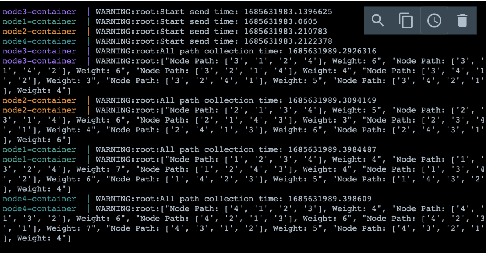

# Project

This repository contains a small project developed for the Computer Network and Algorithm class. The project focuses on implementing parallel breadth-first search in a computer network with four nodes.

## Installations

To install and run the project, follow these

```bash
git clone https://github.com/nutthanonn/computer-netowrk-parallel-breadth-first-search.git
cd computer-netowrk-parallel-breadth-first-search
cd src
docker compose up -d
```

_NOTE: You can view the difference output by logging into the Docker container's terminal._

# Result on docker container


